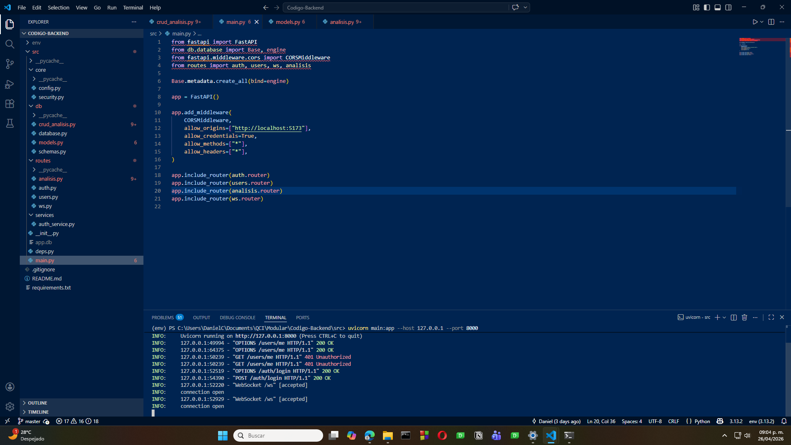

# ⚙️ KRYPTOS Backend

Backend desarrollado con **FastAPI** encargado de gestionar la comunicación entre la aplicación de escritorio y el dashboard web.

---

## 📌 Descripción

Este proyecto implementa una API REST junto con comunicación en tiempo real mediante WebSockets para permitir la sincronización en tiempo real de los resultados del análisis emocional.

Además incorpora autenticación mediante JWT para proteger los servicios disponibles.

---

## ✨ Funcionalidades

- 🔐 Autenticación JWT
- 📡 API REST
- ⚡ Comunicación mediante WebSockets
- 📊 Envío de resultados al dashboard
- 🔄 Sincronización en tiempo real

---

## 🛠️ Tecnologías

- Python
- FastAPI
- Uvicorn
- SQLite
- JWT
- WebSockets

---

## 📸 Capturas

### API funcionando



---

## 🚀 Instalación

```bash
git clone https://github.com/DanielC027/modular-backend.git

cd modular-backend

pip install -r requirements.txt

uvicorn main:app --host 127.0.0.1 --port 8000
```

---

## 🔗 Proyecto relacionado


Este repositorio forma parte del proyecto **KRYPTOS** junto con:

- modular-escritorio
- modular-pagina-web


---

## 👨‍💻 Autor

**Daniel Canela**

Universidad de Guadalajara
